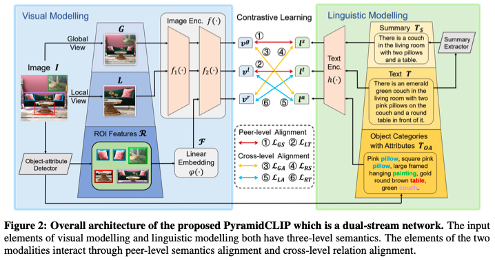

<!-- # PyramidCLIP
PyramidCLIP: Hierarchical Feature Alignment for Vision-language Model Pretraining.

Our paper is available on [arxiv]https://arxiv.org/abs/2204.14095) -->

## Introduction
Large-scale vision-language pre-training has achieved promising results on down-stream tasks. Existing methods highly rely on the assumption that the image-text pairs crawled from the Internet are in perfect one-to-one correspondence. However, in real scenarios, this assumption can be difficult to hold: the text description, obtained by crawling the affiliated metadata of the image, often suffers from the semantic mismatch and the mutual compatibility. To address these issues, we introduce PyramidCLIP, which constructs an input pyramid with different semantic levels for each modality, and aligns visual elements and linguistic elements in the form of hierarchy via peer-level semantics alignment and cross-level relation alignment. Furthermore, we soften the loss of negative samples (unpaired samples) so as to weaken the strict constraint during the pre-training stage, thus mitigating the risk of forcing the model to distinguish compatible negative pairs. Experiments on five downstream tasks demonstrate the effectiveness of the proposed PyramidCLIP. In particular, with the same amount of 15 million pre-training image-text pairs, PyramidCLIP exceeds CLIP on ImageNet zero-shot classification top-1 accuracy by 10.6%/13.2%/10.0% with ResNet50/ViT-B32/ViT-B16 based image encoder respectively. When scaling to larger datasets, PyramidCLIP achieves the state-of-the-art results on several downstream tasks. In particular, the results of PyramidCLIP-ResNet50 trained on 143M image-text pairs surpass that of CLIP using 400M data on ImageNet zero-shot classification task, significantly improving the data efficiency of CLIP.



## Updates
**20220920** PyramidCLIP models pretrained on 15M image-text pairs are released.
**20220915** PyramidCLIP is accepted by NeurIPS2022.

## PyramidCLIP Model-Zoo

### PyramidCLIP models on 143M dataset

<table><tbody>
<!-- START TABLE -->
<!-- TABLE HEADER -->
<th valign="center">Method</th>
<th valign="center">Dataset</th>
<th valign="center">Model</th>
<th valign="center">Epochs</th>
<th valign="center">IN ZS Top-1</th>
<th valign="center">Weights</th>

<tr>
<td align="center">PyramidCLIP</td>
<td align="center">TOTAL143M</td>
<td align="center">ResNet50</td>
<td align="center">32</td>
<td align="center">61.4</td>
<td align="center"><a href="">GoogleDriver</a></td>
</tr>

 
<tr>
<td align="center">PyramidCLIP</td>
<td align="center">TOTAL143M </td>
<td align="center">ViT-B32</td>
<td align="center">32</td>
<td align="center">62.5</td>
<td align="center"><a href="">GoogleDriver</a></td>
</tr>

<tr>
<td align="center">PyramidCLIP</td>
<td align="center"> TOTAL143M </td>
<td align="center">ViT-B16</td>
<td align="center">32</td>
<td align="center">66.9</td>
<td align="center"><a href="">GoogleDriver</a></td>
</tr>
 
 
 </tbody></table>

### PyramidCLIP models on YFCC15M-V1 dataset

<table><tbody>
<!-- START TABLE -->
<!-- TABLE HEADER -->
<th valign="center">Method</th>
<th valign="center">Dataset</th>
<th valign="center">Model</th>
<th valign="center">Epochs</th>
<th valign="center">IN ZS Top-1</th>
<th valign="center">Weights</th>

<tr>
<td align="center">PyramidCLIP</td>
<td align="center">YFCC15M-V1</td>
<td align="center">ResNet50</td>
<td align="center">32</td>
<td align="center">43.8</td>
<td align="center"><a href="https://drive.google.com/file/d/1CwS4K_DQ16ykbOGzDCZAyQkbBwrt8Dk6/view?usp=sharing">GoogleDriver</a></td>
</tr>

 
<tr>
<td align="center">PyramidCLIP</td>
<td align="center">YFCC15M-V1</td>
<td align="center">ViT-B32</td>
<td align="center">32</td>
<td align="center">41.7</td>
<td align="center"><a href="https://drive.google.com/file/d/1DIEcAKoJJnn-qTGF8M5NQxzhGXmH1i7l/view?usp=sharing">GoogleDriver</a></td>
</tr>

<tr>
<td align="center">PyramidCLIP</td>
<td align="center">YFCC15M-V1</td>
<td align="center">ViT-B16</td>
<td align="center">32</td>
<td align="center">45.9</td>
<td align="center"><a href="https://drive.google.com/file/d/1uaRxNX2us0Zli0Wno3jpNEVAj5DZEzjq/view?usp=sharing">GoogleDriver</a></td>
</tr>
 
 </tbody></table>

### PyramidCLIP models on YFCC15M-V2 dataset
<table><tbody>
<!-- START TABLE -->
<!-- TABLE HEADER -->
<th valign="center">Method</th>
<th valign="center">Dataset</th>
<th valign="center">Model</th>
<th valign="center">Epochs</th>
<th valign="center">IN ZS Top-1</th>
<th valign="center">Weights</th>

<tr>
<td align="center">PyramidCLIP</td>
<td align="center">YFCC15M-V2</td>
<td align="center">ResNet50</td>
<td align="center">32</td>
<td align="center">47.8</td>
<td align="center"><a href="https://drive.google.com/file/d/1UMPWusj4ewW8FrT622d-fNPMbjG3yx1_/view?usp=sharing">GoogleDriver</a></td>
</tr>

 
<tr>
<td align="center">PyramidCLIP</td>
<td align="center">YFCC15M-V2</td>
<td align="center">ViT-B32</td>
<td align="center">32</td>
<td align="center">46.0</td>
<td align="center"><a href="https://drive.google.com/file/d/1YCGzgUTiXZ9NudvV55lv-QiK2n4RW6jl/view?usp=sharing">GoogleDriver</a></td>
</tr>

<tr>
<td align="center">PyramidCLIP</td>
<td align="center">YFCC15M-V2</td>
<td align="center">ViT-B16</td>
<td align="center">32</td>
<td align="center">50.7</td>
<td align="center"><a href="https://drive.google.com/file/d/1JsV7xPWpG-rCe6Brnt3tIKYZ8l0U__TM/view?usp=sharing">GoogleDriver</a></td>
</tr>
 
 </tbody></table>


## Inference  
see demo.py  

## Zero-shot Evaluation  

### Preparation
1) Download the checkpoint from PyramidCLIP model zoo, and put into the pretrained_model/ directory.
2) Copy the test data of ImageNet into /path/val/. 

### Run Evaluation  
see test.sh  
```shell
pip install ftfy regex

python3 -um torch.distributed.launch --nnodes=$HOST_NUM --nproc_per_node=$HOST_GPU_NUM \
--node_rank=$INDEX --master_port=3111 --master_addr=$CHIEF_IP \
main.py \
--visual_model RN50 \ # RN50|ViT-B-32|ViT-B-16
--batch_size_test 256 \
--test_dataset imagenet \
--test_data_path /path/val/ \
--precision fp32 \
--evaluate pretrained_model/RN50.pth.tar
```
